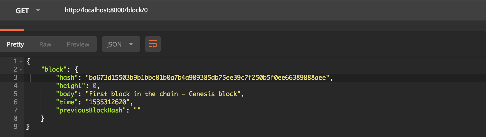
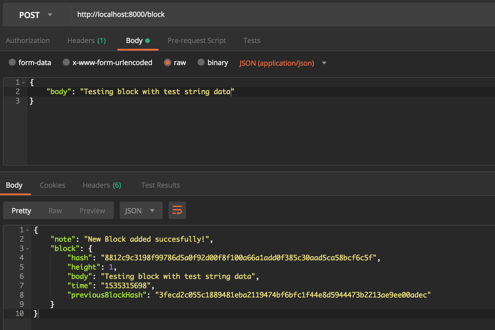

## Node.js framework used

Express.js (https://expressjs.com)

## Testing
- API service will run on port 8000
- In the terminal run command to start the server:


## GET block endpoint
GET response example for URL http://localhost:8000/block/0
The GET endpoint is built with following path: "/block/:blockHeight"

The endpoint has been tested using Postman (https://www.getpostman.com)



## POST block endpoint
POST response example for URL http://localhost:8000/block

The endpoint has been tested using Postman (https://www.getpostman.com)
body property tested as raw-data, application/json: 
```js
{
	"body": "Testing block with test string data"
}
```

