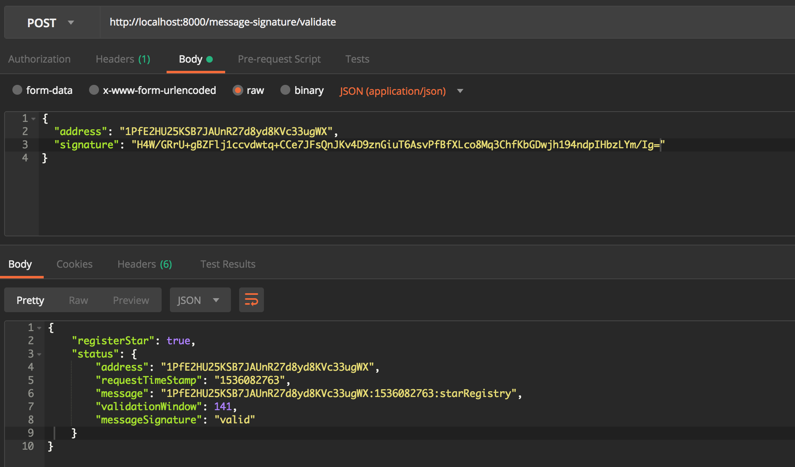

# Star Registry - Blockchain Notary Service

## Node.js framework used

Express.js (https://expressjs.com)

## Start the Web Service
- API service will run on port 8000
- In the terminal run command to start the server:

## POST request to validate a Star Registration
URL: http://localhost:8000/requestValidation

- when refreshing requestTimeStamp is the same, while validation Window decreases.

## POST validating message signatures
URL: http://localhost:8000/message-signature/validate

- Signature and Message Validation using Electrum Wallet https://electrum.org/#home

- Upon validation, the user is granted access to register a single star.

## POST add a star registry in Block body (after validation)
URL: http://localhost:8000/block

- Star object and properties are stored within the body of the block.

- Star properties include the coordinates with encoded story.

- only one star can be registered for each validation, refreshing the window will not allow for a new star registration.

## GET star block by wallet address (blockchainidentity) with JSON response.
URL: http://localhost:8000/stars/address:[ADDRESS]

- Response includes entire star block contents along with the addition of star story decoded.
- Multiple stars might be registered to a single blockchain identity.
- The response should support multiple star blocks.

## GET star block by hash with JSON response.
URL: http://localhost:8000/stars/hash:[HASH]

- Response includes entire star block contents along with the addition of star story decoded.

## GET star block by starblock height with JSON response.
URL: http://localhost:8000/block/[HEIGHT]

- Response includes entire star block contents along with the addition of star story decoded.

- Genesis Block will not carry stars information.

------------------
All endpoints have been tested using Postman (https://www.getpostman.com)